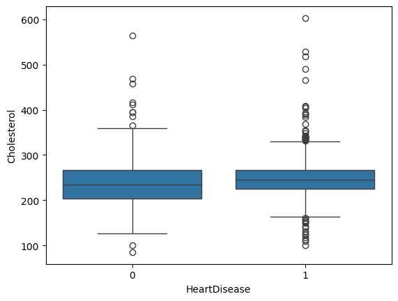
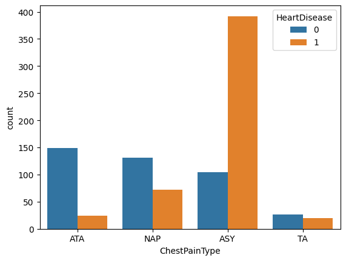
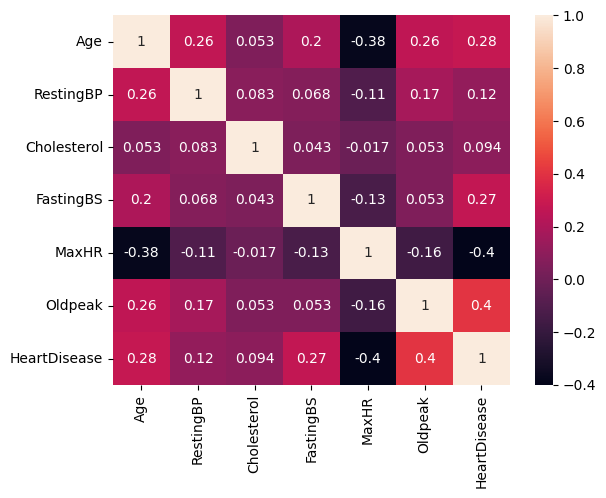
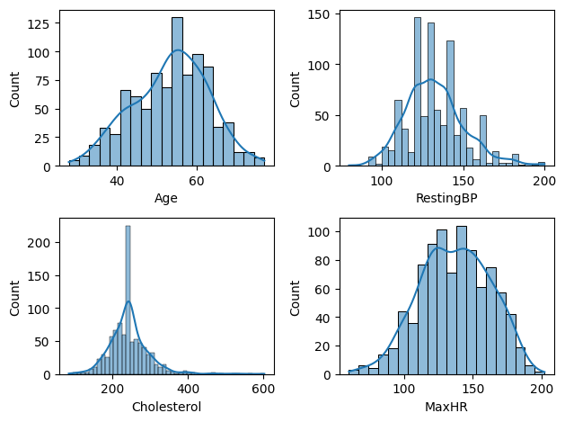

# 📌 Heart Disease Prediction using Machine Learning

## 🧠 Project Overview
This project aims to predict whether a person is likely to have heart disease based on various medical attributes. It uses data analysis, visualization, and machine learning techniques to build an accurate predictive model.

---

## 📊 Dataset
- The dataset used: `heart.csv`
- Contains medical features such as:
  - Age
  - Sex
  - Chest Pain Type
  - Resting Blood Pressure
  - Cholesterol
  - Fasting Blood Sugar
  - Maximum Heart Rate
  - Exercise-induced Angina
  - Target: `HeartDisease` (0 = No, 1 = Yes)

---

## 🔄 Project Workflow

1. **Problem Definition**
   - Predict whether a person has heart disease based on medical features.

2. **Data Collection**
   - Loaded dataset (`heart.csv`) using Pandas.

3. **Data Understanding**
   - Checked shape, columns, and data types
   - Used `.info()` and `.describe()` for insights

4. **Data Cleaning**
   - Handled invalid values (e.g., 0 in cholesterol, BP)
   - Replaced them with mean values
   - Removed duplicates (if any)

5. **Exploratory Data Analysis (EDA)**
   - Visualized feature distributions using histograms
   - Checked target variable balance
   - Identified patterns and outliers

6. **Feature Selection / Preprocessing**
   - Selected relevant features
   - Split data into features (X) and target (y)
   - Train-test split

7. **Model Building**
   - Trained multiple machine learning models:
     - Logistic Regression
     - Decision Tree
     - Random Forest
     - Naive Bayes
     - Support Vector Machine

8. **Model Evaluation**
   - Compared models using:
     - Accuracy score
     - Confusion matrix
   - Selected the best-performing model

9. **Conclusion**
   - Identified the most accurate model
   - Observed impact of data cleaning on performance

---

## 🤖 Model Performance Comparison

| Model                | Accuracy Score | F1-Score |
|---------------------|---------------|------------|
| Logistic Regression |0.8696         |0.8857      |
| Decision Tree       |0.7663         |0.7902      |
| Naive Bayes         |0.8533         |0.8683      |
| KNN                 |0.8641         |0.8815      |
| SVM                 |0.8478         |0.8679      |


---

## 🏆 Best Model
- The best performing model is: Logistic Regression
- Achieved highest accuracy of: 0.8696
- Achieved highest f1-score of: 0.8857

---

## 📊 Evaluation Metrics Used
- Accuracy Score
- F1-score

---

## 🤖 Machine Learning
- Split data into training and testing sets
- Applied machine learning algorithms such as:
  - Logistic Regression
  - Decision Tree
  - Random Forest
- Evaluated model performance using:
  - Accuracy score
  - Confusion matrix

---

## 🛠️ Technologies Used
- Python 
- Pandas
- NumPy
- Matplotlib
- Seaborn
- Scikit-learn

---

## 🚀 How to Run the Project
```bash
# Clone the repository
git clone https://github.com/your-username/heart-disease-prediction.git

# Navigate to the folder
cd heart-disease-prediction

# Install dependencies
pip install -r requirements.txt

# Run Jupyter Notebook
jupyter notebook
```

---

## 🔑 Key Insights

- 📊 Most patients with higher age showed increased risk of heart disease
- ❤️ Certain chest pain types are strongly associated with heart disease
- 📉 Higher cholesterol and resting blood pressure contribute to higher risk
- 🧍 Male patients showed slightly higher chances of heart disease compared to females
- ⚡ Maximum heart rate achieved is an important indicator of heart condition
- 🔍 Data cleaning (handling zero values) significantly improved model accuracy

---

## 🖼️ Visual Insights

### 📊 cholesterol vs heartdisease


### 📈 Feature Distribution


### 🔥 Correlation Heatmap


### 📉 Distribution plot


### 📸 API Interface


### 🌐 API High Risk Image


### API Low Risk Image


---

## 📌 Conclusion

- This project successfully predicts the likelihood of heart disease using machine learning techniques.
- Data preprocessing and cleaning played a crucial role in improving model performance.
- Multiple models were trained and evaluated, and the best-performing model was selected based on accuracy.
- The project demonstrates how data-driven approaches can assist in early diagnosis of critical diseases.
- With further improvements and deployment, this solution can be used in real-world healthcare applications.

---

## 🚀 Future Scope

- Improve accuracy using advanced models like XGBoost
- Perform hyperparameter tuning
- Deploy the model using Flask or Streamlit
- Integrate with real-time healthcare systems

---

## 📧 Contact

**Author:** Pranjal Pandey

**Email:** Pranjalpandey0301@gmail.com

**LinkedIn:** https://www.linkedin.com/in/pranjal-pandey-501a5a244
